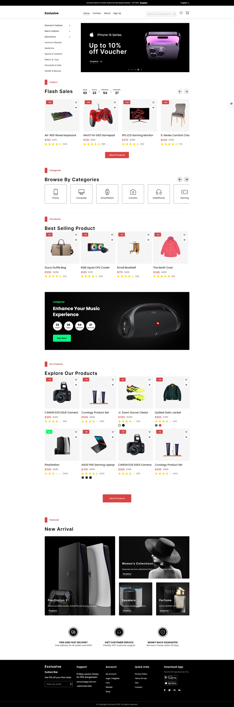
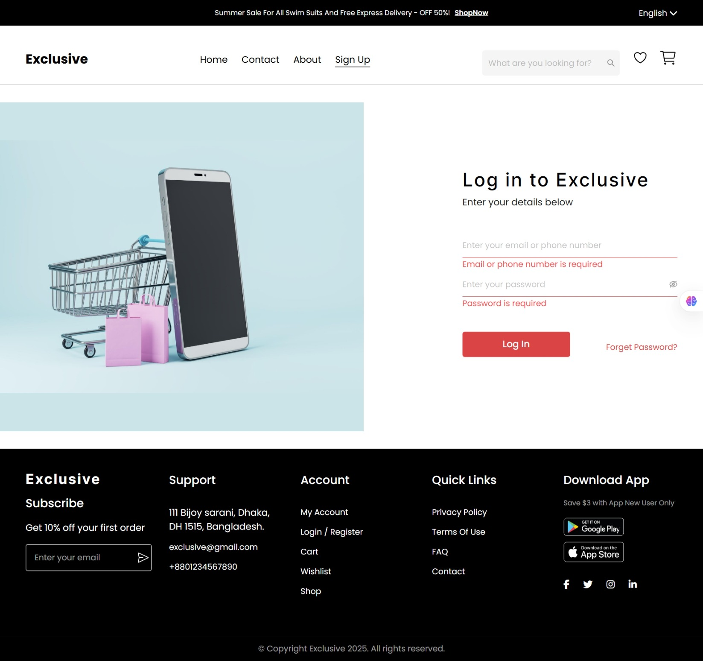
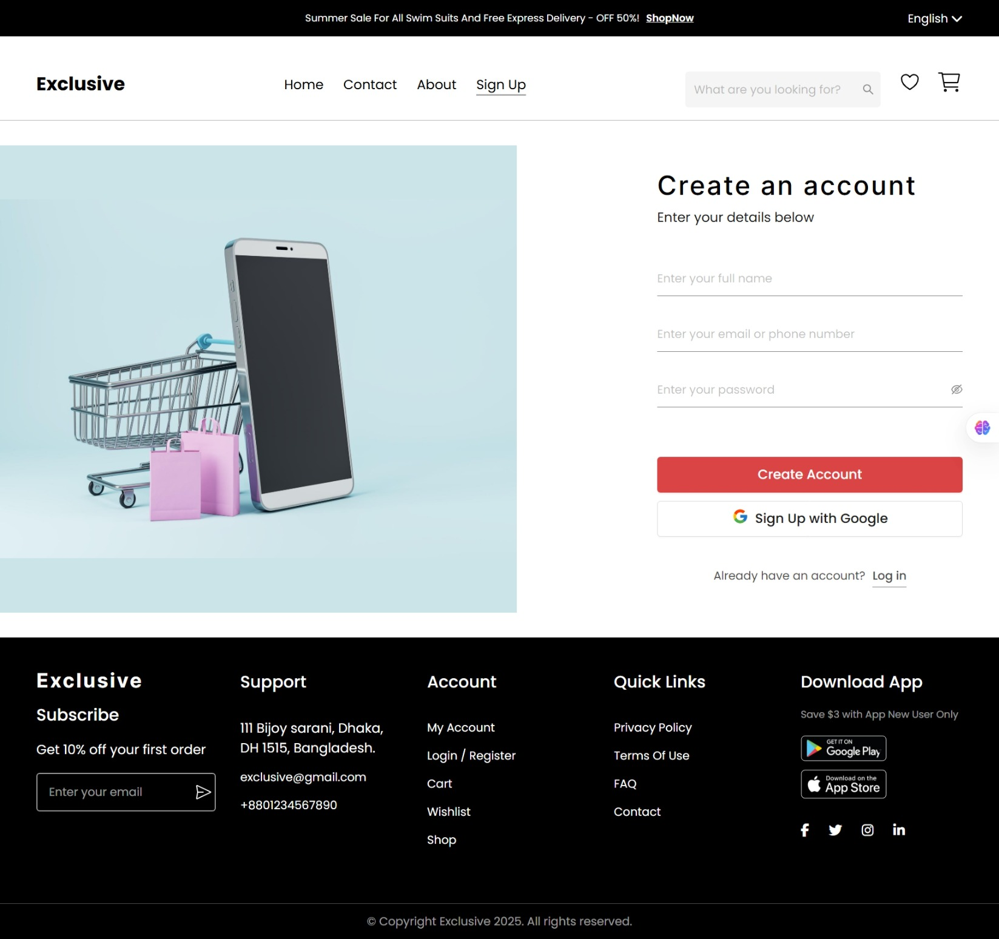
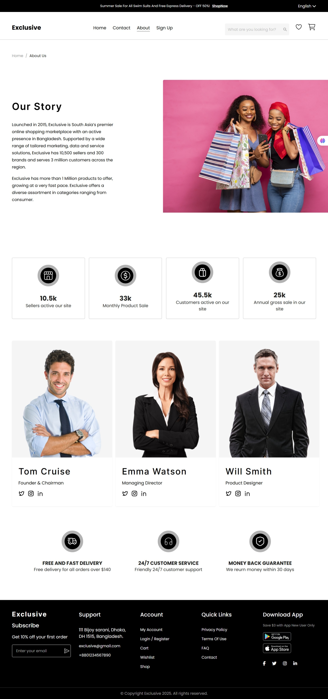
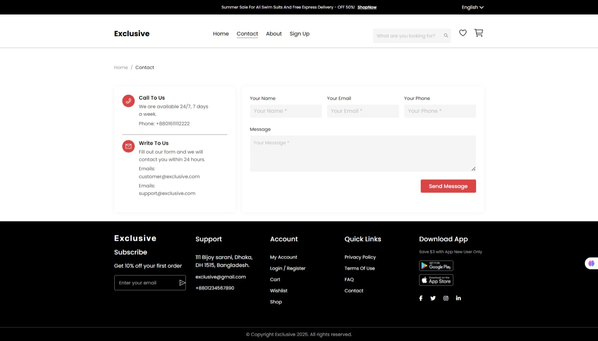
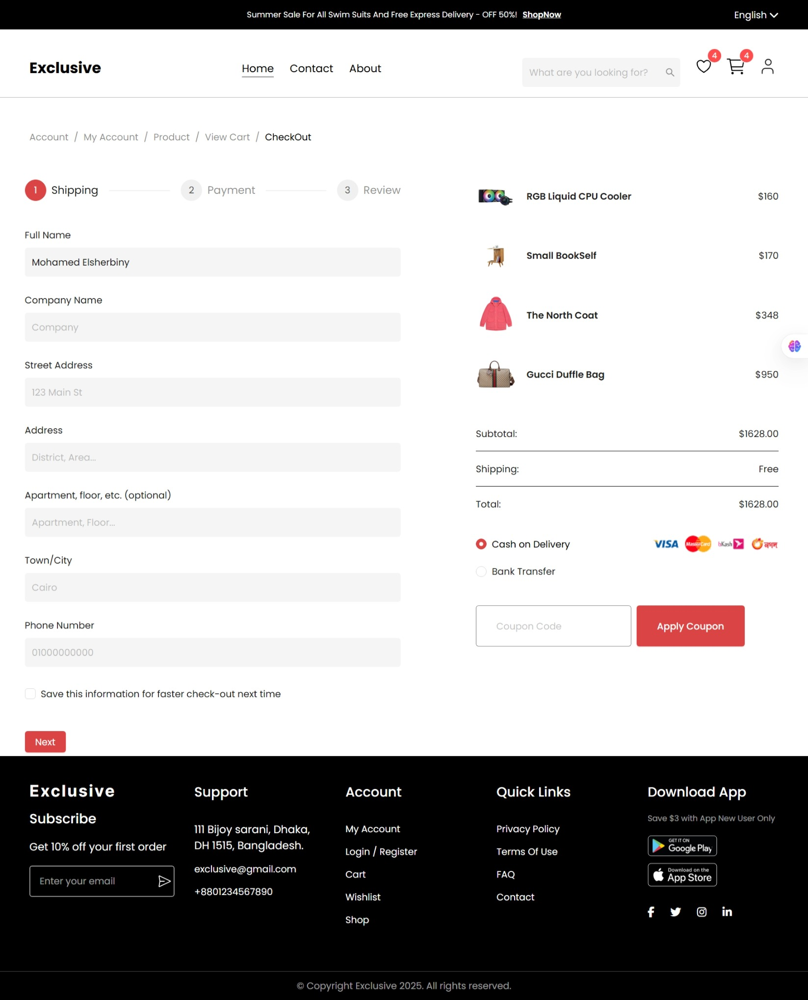
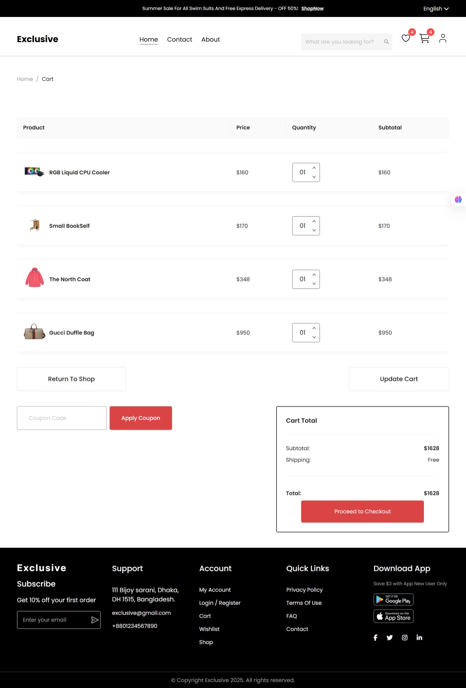

# E-Commerce Website (React + TypeScript)

## Project Overview  
This project is a **multi-page e-commerce website frontend** built using **React + TypeScript**, following a modern and modular architecture.  
It allows users to **browse products, manage cart & wishlist, sign up/login, and complete checkout with Stripe payment integration**.  
The app is styled consistently using **Ant Design** and **SCSS**, ensuring a responsive, accessible, and SEO-friendly user experience.  

---


## Features

### Home Page
- Hero banner with **CTA (Shop Now)**
- Featured product categories
- Product preview grid
- Footer with navigation links  

### Authentication
- **Sign Up** with validation (name, email, strong password)
- **Login** with validation (email & password)
- On successful login → account dropdown with Profile, Orders, Logout  

### E-Commerce Flows
- **Category Page:** Filtered products + sorting by price/popularity  
- **Product Details:** Image, price, description, Add to Cart/Wishlist  
- **Wishlist Page:** Move to cart or remove items  
- **Cart Page:** Update quantity, remove products, view subtotal, proceed to checkout  
- **Checkout Flow:** Multi-step (Shipping Info → Payment → Review)  
- **Stripe Payment Integration:** Secure card input + success/failure handling  

### Account Page
- User profile info  
  

### Static Pages
- About Page (company story)  
- Contact Page (validated form)  
- 404 Page (with “Back to Home” button)  

### Additional Features
- Live **search bar** for filtering products  
- **Persist cart & wishlist** via `localStorage`  
- **Dark/Light theme** toggle  
- **SEO optimization** with React Helmet & sitemap  
- **Lazy loading** for performance improvement  

---
### Live Demo
Check out the live version of the project here:  
[**Live Demo on Netlify**](https://store-exclusive.netlify.app/)

---

### Figma Design
You can view the original design file on Figma:  
[**View Figma Design**](https://www.figma.com/design/qyxztIpktPfsJsfsnymDFe/Frontend-Task?node-id=0-1&p=f&t=tihUEy1s5NnvQROa-0)

---

## Tech Stack

| Category               | Technology                                    |
| ---------------------- | --------------------------------------------- |
| **Frontend Library**   | React.js (with TypeScript)                    |
| **Styling**            | SCSS (modular) + Ant Design                   |
| **State Management**   | Redux Toolkit                                 |
| **Forms & Validation** | React Hook Form + Yup                         |
| **Payment**            | Stripe (Stripe.js + React Stripe.js)          |
| **SEO & Performance**  | React Helmet, lazy loading, responsive images |
| **Mock API**           | local mock data                               |

---

## Core Functionalities Breakdown

| Module               | Description                                             |
| -------------------- | ------------------------------------------------------- |
| **Authentication**   | Register, login, logout flow + user persistence         |
| **Cart Management**  | Add, remove, update items with Redux Toolkit            |
| **Wishlist**         | Save favorite products locally                          |
| **Checkout**         | Multi-step form with validation and payment integration |
| **Search**           | Real-time search bar across product listings            |
| **SEO Optimization** | Helmet meta tags + sitemap + high Lighthouse score      |

---

## Setup & Run Instructions

1. Clone the repository
    ```bash
    git clone https://github.com/yourusername/ecommerce-frontend.git
    cd Frontend-ecommerce-react\frontend
    ```
2. Install dependencies
    ```bash
    npm install
    # or
    yarn install
    ```
3. Run the development server
    ```bash
    npm run dev 
    ```
    or
    ```bash
    yarn dev
    ```
4. Environment Variables
    ```
    VITE_STRIPE_PUBLIC_KEY=your_stripe_public_key
    ```

## Stripe Integration
- Integrated using **Stripe.js + React Stripe.js**  
- Secure card input using **Elements API**  
- Handles **success and failure states** within the checkout flow  
- Test Cards for development:
  - `4242 4242 4242 4242` — Payment success
  - `4000 0000 0000 9995` — Payment declined

## 📷 Screenshots

| Page            | Desktop                                               |
| --------------- | ----------------------------------------------------- |
| Home            |          |
| Login           |            |
| Signup          |           |
| About           |             |   
| Contact         |         |
| Checkout        |       |
| Cart            |               |
| Wishlist        |       |

